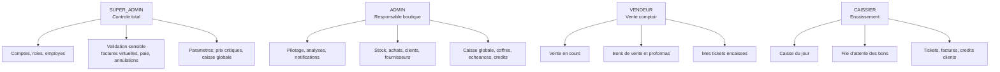
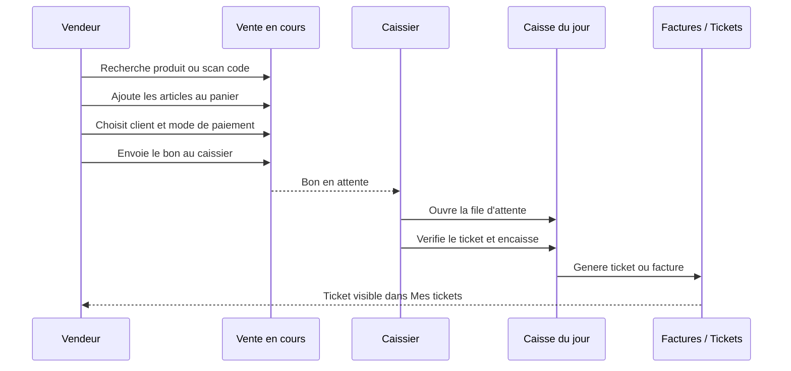
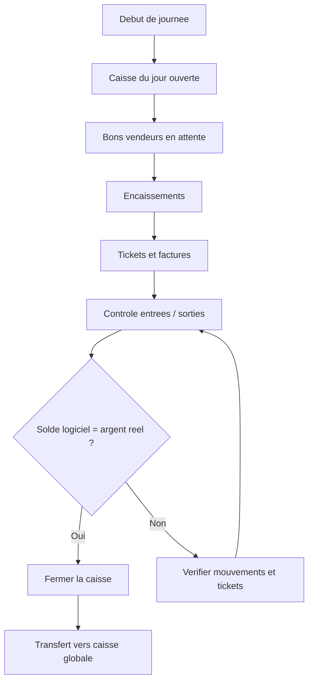

# Guide utilisateurs et roles - NEWOTEG / X-electronic

Derniere mise a jour : 2026-06-29  
Projet : NEWOTEG, branche boutique X-electronic  
Application concernee : dashboard admin local et production

## 1. Objectif du guide

Ce guide sert de support de formation pour l'installation du projet en boutique. Il explique ce que chaque utilisateur peut faire selon son role, comment se connecter, quels menus utiliser, et quels parcours suivre pour vendre, encaisser, gerer le stock, suivre la caisse et administrer l'equipe.

La source technique actuelle des permissions est principalement :

- `Font-end-admin/NEWOTEG-ECOMMERCE-feature-new-dashboard/src/utils/permissions.ts`
- `Font-end-admin/NEWOTEG-ECOMMERCE-feature-new-dashboard/src/App.tsx`
- `Back-end/prisma/schema.prisma`, enum `AdminRole`

## 2. Montage recommande du guide

Pour la boutique, le meilleur montage est en deux niveaux :

1. Un guide central complet, ce fichier Markdown, pour le responsable, la formation initiale et l'impression.
2. Une future page integree dans l'admin, par exemple `Guide utilisateur`, qui affichera automatiquement le guide adapte au role connecte.

Structure ideale dans l'application plus tard :

- `Guide rapide` : les 5 actions quotidiennes de l'utilisateur connecte.
- `Mon role` : ce que le compte peut faire et ne peut pas faire.
- `Parcours boutique` : vente, encaissement, ticket, facture, credit.
- `Problemes courants` : connexion, caisse fermee, ticket introuvable, stock insuffisant.
- `Administration` : comptes, roles, prix, stock, caisse globale, paie.

Visuellement, dans l'admin, cette page devrait etre accessible depuis la sidebar ou le menu profil. Le contenu devra etre filtre par role pour eviter qu'un vendeur voie un guide super admin trop complexe.

## 3. Roles existants

Les roles techniques presents dans le projet sont :

| Role | Profil metier | Connexion principale | Utilisation recommandee |
| --- | --- | --- | --- |
| `SUPER_ADMIN` | Proprietaire / direction | Mot de passe | Administration totale, comptes, roles, validations sensibles |
| `ADMIN` | Responsable boutique / gestionnaire | Mot de passe | Pilotage quotidien, stock, caisse, achats, clients, rapports |
| `VENDEUR` | Commercial comptoir | PIN boutique | Creation des bons de vente, proformas, suivi de ses tickets |
| `CAISSIER` | Caisse boutique | PIN boutique | Encaissement, caisse du jour, credits clients, factures |
| `MANAGER` | Role technique partiel | Mot de passe | Existe dans le schema, mais parcours interface incomplet actuellement |

Important : pour l'installation en boutique, les roles a utiliser en priorite sont `SUPER_ADMIN`, `ADMIN`, `VENDEUR` et `CAISSIER`. Le role `MANAGER` doit rester reserve tant que son parcours complet n'est pas finalise dans l'interface.

## 4. Visuel global des responsabilites



## 5. Connexion

### Connexion par mot de passe

Utilisee par `SUPER_ADMIN`, `ADMIN` et le role technique `MANAGER`.

Etapes :

1. Aller sur la page `/login`.
2. Choisir l'onglet `Mot de passe`.
3. Entrer le nom d'utilisateur ou l'email.
4. Entrer le mot de passe.
5. Cliquer sur `Se connecter`.

La session mot de passe dure plus longtemps que la session PIN. Elle est adaptee aux responsables qui travaillent sur un ordinateur de gestion.

### Connexion par PIN boutique

Utilisee par `VENDEUR` et `CAISSIER`.

Etapes :

1. Aller sur la page `/login`.
2. Choisir l'onglet `PIN boutique`.
3. Entrer le nom d'utilisateur.
4. Saisir le PIN de 4 a 6 chiffres.
5. Cliquer sur `Entrer avec le PIN`.

Ce mode est prevu pour une utilisation rapide en boutique, notamment sur tablette ou poste comptoir.

## 6. Matrice des menus par role

| Menu / Fonction | SUPER_ADMIN | ADMIN | VENDEUR | CAISSIER | MANAGER |
| --- | --- | --- | --- | --- | --- |
| Tableau de bord | Oui | Oui | Non | Non | Non |
| Analyses | Oui | Oui | Non | Non | Non |
| Notifications | Oui | Oui | Non | Non | Non |
| Caisse du jour | Oui | Oui | Non | Oui | Non |
| Caisse globale | Oui | Oui | Non | Non | Non |
| Coffres | Oui | Oui | Non | Non | Non |
| Paie | Oui | Oui | Non | Non | Non |
| Credits clients | Oui | Oui | Non | Oui | Non |
| Echeances | Oui | Oui | Non | Non | Non |
| CMUP & Valorisation | Oui | Oui | Non | Non | Non |
| Vente en cours | Oui | Oui | Oui | Non | Non |
| Mes tickets | Oui | Oui | Oui | Non | Non |
| Primes vendeurs | Oui | Oui | Non | Non | Non |
| Commandes en ligne | Oui | Oui | Oui | Non | Non |
| Produits | Oui | Oui | Oui, consultation | Oui, consultation | Oui, consultation |
| Categories | Oui | Oui | Non | Non | Non |
| Mouvements stock | Oui | Oui | Non | Non | Non |
| Inventaire | Oui | Oui | Non | Non | Non |
| Alertes stock | Oui | Oui | Non | Non | Non |
| Bons de commande fournisseur | Oui | Non | Non | Non | Non |
| Achats / Reapprovisionnement | Oui | Oui | Non | Non | Partiel technique |
| Clients | Oui | Oui | Oui | Non | Non |
| Fournisseurs | Oui | Oui | Non | Non | Non |
| Employes | Oui | Non | Non | Non | Non |
| Roles | Oui | Non | Non | Non | Non |
| Parametres | Oui | Non | Non | Non | Non |

Note : certains ecrans existent techniquement par URL, comme `/file-caissier`, `/invoices` ou `/proformas`. Le parcours principal visible pour le caissier passe par `Caisse du jour`, qui embarque la file d'attente, les encaissements, les mouvements, les proformas et les factures.

## 7. Parcours vente boutique



### Role du vendeur dans ce parcours

Le vendeur ne finalise pas directement l'encaissement. Il prepare la vente :

1. Ouvrir `Vente en cours`.
2. Rechercher un produit par nom, marque, code ou scan.
3. Ajouter les articles au panier.
4. Ajuster les quantites dans la limite du stock disponible.
5. Choisir le client si necessaire.
6. Choisir le mode de paiement annonce par le client.
7. Cliquer sur l'action d'envoi au caissier.
8. Suivre le bon dans l'onglet des ventes en attente ou dans `Mes tickets` une fois encaisse.

### Role du caissier dans ce parcours

Le caissier transforme le bon en vente encaissee :

1. Ouvrir `Caisse du jour`.
2. Aller dans l'onglet `A encaisser`.
3. Selectionner le ticket recu du vendeur.
4. Verifier les articles, le montant total et le mode de paiement.
5. Pour une vente a credit, selectionner obligatoirement un client enregistre.
6. Saisir l'acompte si le client paie une partie aujourd'hui.
7. Cliquer sur `Encaisser`.
8. Imprimer le ticket ou la facture si necessaire.

## 8. Role SUPER_ADMIN

### Mission

Le `SUPER_ADMIN` est le proprietaire fonctionnel du systeme. Il peut tout voir et effectuer les actions sensibles.

### Acces principaux

- Pilotage : tableau de bord, analyses, notifications.
- Finance : caisse du jour, caisse globale, coffres, paie, credits, echeances, CMUP.
- Boutique : vente en cours, tickets, primes.
- E-commerce : commandes en ligne.
- Catalogue : produits, categories, stock, inventaire, alertes, bons de commande, achats.
- Relation : clients, fournisseurs, employes, roles.
- Systeme : parametres.

### Actions reservees ou sensibles

- Creer, modifier, desactiver ou supprimer un compte employe.
- Reinitialiser un mot de passe.
- Changer le role d'un utilisateur.
- Rouvrir une caisse du jour fermee.
- Valider certaines actions sensibles de paie.
- Approuver ou refuser une facture virtuelle.
- Modifier les prix critiques des produits.
- Gerer les bons de commande fournisseur.
- Supprimer des donnees lorsque l'interface l'autorise.

### Routine recommandee

1. Se connecter par mot de passe.
2. Verifier le tableau de bord.
3. Lire les notifications importantes.
4. Controler les alertes stock et les echeances.
5. Controler la caisse globale et les coffres.
6. Examiner les factures virtuelles en attente.
7. Gerer les comptes si un employe arrive, change de poste ou quitte l'entreprise.

### A eviter

- Donner le role `SUPER_ADMIN` a plusieurs personnes sans raison.
- Utiliser un compte super admin pour les ventes ordinaires si un vendeur ou admin peut le faire.
- Changer un role sans motif operationnel.

## 9. Role ADMIN

### Mission

L'`ADMIN` est le responsable operationnel. Il suit la boutique, le stock, les ventes, les achats et les finances courantes.

### Acces principaux

- Tableau de bord, analyses, notifications.
- Caisse du jour et caisse globale.
- Coffres, paie, credits clients, echeances, CMUP.
- Vente en cours et tickets.
- Commandes en ligne.
- Produits, categories, mouvements stock, inventaire, alertes stock, achats.
- Clients et fournisseurs.
- Factures, proformas et primes vendeurs.

### Limites

L'`ADMIN` ne doit pas etre considere comme proprietaire systeme. Il ne gere pas normalement :

- les comptes employes ;
- les roles ;
- les parametres systeme ;
- les actions super sensibles reservees au `SUPER_ADMIN`.

### Routine recommandee

1. Se connecter par mot de passe.
2. Consulter `Tableau de bord` et `Analyses`.
3. Verifier les commandes en ligne.
4. Controler les ruptures et alertes stock.
5. Suivre les achats et mouvements stock.
6. Surveiller la caisse du jour et la caisse globale.
7. Consulter les credits clients et les echeances.

### Cas particulier : vente par admin

L'`ADMIN` peut utiliser `Vente en cours`. Dans ce cas, le flux peut envoyer un ticket au caissier, comme pour un vendeur. Pour une installation propre, il vaut mieux former les vendeurs a vendre et les caissiers a encaisser, afin que les responsabilites restent claires.

## 10. Role VENDEUR

### Mission

Le `VENDEUR` gere la vente au comptoir : il conseille le client, recherche les produits, prepare le panier et envoie le bon au caissier.

### Connexion

Le vendeur se connecte avec son nom d'utilisateur et son PIN boutique.

### Menus principaux

- `Vente en cours`
- `Mes tickets`
- `Commandes en ligne`
- `Produits`, principalement en consultation
- `Clients`
- `Proformas`, selon parcours accessible

### Comment faire une vente

1. Aller dans `Vente en cours`.
2. Rechercher le produit demande.
3. Utiliser le scan code si le produit a un code scannable.
4. Ajouter le produit au panier.
5. Verifier la quantite disponible.
6. Selectionner le client si le client est deja enregistre.
7. Choisir le mode de paiement annonce.
8. Envoyer le bon au caissier.
9. Attendre que le caissier encaisse.
10. Verifier la vente dans `Mes tickets`.

### Equivalences de composants

L'equivalence doit etre utilisee uniquement pour les composants et pieces electroniques du catalogue X-electronic, par exemple :

- diode ;
- transistor ;
- resistance ;
- condensateur ;
- circuit integre ;
- connecteur ;
- module electronique ;
- capteur ;
- relais ;
- regulateur ;
- fusible ;
- inductance.

Regle importante : l'equivalence ne doit pas inventer un produit externe. Elle doit proposer uniquement un produit reel present en base, avec un `produitId` existant et du stock disponible.

Si aucune equivalence n'apparait, le vendeur doit :

1. Verifier l'orthographe de la recherche.
2. Chercher par code, marque ou famille si disponible.
3. Eviter les demandes hors catalogue comme accessoires generiques non electroniques.
4. Signaler au responsable si un composant courant manque au catalogue.

### Proforma

Le vendeur peut creer une proforma lorsque le client veut un devis avant paiement.

Etapes :

1. Ajouter les produits au panier.
2. Cliquer sur `Creer proforma`.
3. Renseigner le client si necessaire.
4. Imprimer ou remettre la proforma.
5. Transformer plus tard la proforma en vente si le client confirme.

### A eviter

- Envoyer un bon sans verifier la quantite.
- Utiliser un client incorrect pour une vente a credit.
- Confondre proforma et vente encaissee.
- Proposer une equivalence qui n'est pas dans le catalogue.

## 11. Role CAISSIER

### Mission

Le `CAISSIER` encaisse les bons de vente, suit la caisse du jour et gere les paiements clients.

### Connexion

Le caissier se connecte avec son nom d'utilisateur et son PIN boutique.

### Menus principaux

- `Caisse du jour`
- `Credits clients`
- `Factures`, via l'espace caisse
- `Proformas`, via l'espace caisse
- `Produits`, principalement en consultation

### Encaisser une vente

1. Ouvrir `Caisse du jour`.
2. Verifier que la caisse est ouverte.
3. Aller dans `A encaisser`.
4. Cliquer sur le ticket en attente.
5. Verifier vendeur, client, articles et total.
6. Choisir ou confirmer le mode de paiement.
7. Pour `CREDIT`, choisir un client enregistre.
8. Saisir un acompte si le client paie une partie.
9. Cliquer sur `Encaisser`.
10. Imprimer le ticket ou la facture.

### Caisse du jour

Le caissier voit :

- le solde courant ;
- les entrees du jour ;
- les sorties du jour ;
- les tickets a encaisser ;
- les encaissements ;
- les mouvements ;
- les factures et proformas.

### Credit client

Pour une vente a credit :

1. Le client doit exister dans la base.
2. Le caissier selectionne le client pendant l'encaissement.
3. L'acompte est optionnel selon le cas.
4. Le reste devient une dette client suivie dans `Credits clients`.

### Fin de journee

Le caissier ou le responsable doit :

1. Verifier les ventes encaissees.
2. Verifier les entrees et sorties de caisse.
3. Comparer le solde logiciel avec l'argent reel.
4. Fermer la caisse si tout est correct.

La reouverture d'une caisse fermee est reservee au `SUPER_ADMIN`.

## 12. Role MANAGER

### Etat actuel

Le role `MANAGER` existe dans le schema Prisma et dans certains controles backend, notamment autour de la validation d'achat. Mais dans le frontend actuel, il n'a pas encore un parcours complet dans la sidebar.

### Recommandation

Ne pas utiliser `MANAGER` pour les premiers utilisateurs boutique. Preferer :

- `ADMIN` pour les responsables ;
- `VENDEUR` pour le comptoir ;
- `CAISSIER` pour la caisse ;
- `SUPER_ADMIN` pour la direction.

Le role `MANAGER` peut devenir utile plus tard si l'entreprise veut un niveau intermediaire entre admin et responsable achat.

## 13. Parcours caisse de fin de journee



## 14. Factures, tickets et factures virtuelles

### Ticket caisse

Utilise pour les ventes comptoir simples. Le caissier peut l'imprimer apres encaissement.

### Facture pro

Utilisee lorsque le client demande une facture plus complete, souvent avec nom, telephone, NIU ou RCCM.

### Facture virtuelle

La facture virtuelle est une facture avec majoration, souvent pour un demarcheur ou un besoin commercial particulier.

Regle actuelle importante :

- une majoration elevee peut necessiter approbation ;
- le `SUPER_ADMIN` peut approuver ou refuser ;
- une facture virtuelle approuvee peut etre imprimee ;
- une facture refusee conserve le motif de refus.

## 15. Gestion des comptes employes

Reservee au `SUPER_ADMIN`.

### Creer un employe

1. Aller dans `Employes` ou `Comptes Admin`.
2. Cliquer sur `Nouvel employe` ou `Créer`.
3. Renseigner le nom, identifiant et role.
4. Pour `VENDEUR` ou `CAISSIER`, definir un PIN.
5. Pour `ADMIN` ou `SUPER_ADMIN`, definir un mot de passe.
6. Enregistrer.

### Changer un role

1. Ouvrir la fiche employe.
2. Cliquer sur le changement de role.
3. Choisir le nouveau role.
4. Renseigner un motif.
5. Si le nouveau role est `VENDEUR` ou `CAISSIER`, definir un PIN.
6. Si le nouveau role est `ADMIN` ou `SUPER_ADMIN`, definir un mot de passe.

### Reinitialiser un acces

Le `SUPER_ADMIN` peut reinitialiser le mot de passe d'un compte. Pour les comptes PIN, verifier que le PIN est bien configure si l'utilisateur doit se connecter en boutique.

## 16. Produits, stock et achats

### Produits

Tous les roles peuvent consulter les produits, mais la gestion complete est reservee aux responsables.

L'admin ou super admin peut :

- creer ou modifier un produit ;
- gerer les images ;
- gerer les prix ;
- suivre le stock ;
- importer des donnees si la fonction est disponible ;
- utiliser les categories et codes famille.

La modification critique des prix produit est reservee au `SUPER_ADMIN`.

### Stock

Les responsables utilisent :

- `Mouvements stock` pour suivre les entrees, sorties et ajustements ;
- `Inventaire` pour compter le stock reel ;
- `Alertes stock` pour reperer les ruptures ou seuils bas.

### Achats et reapprovisionnement

Les achats servent a entrer les produits en stock et a mettre a jour la valorisation.

Le bon de commande fournisseur est reserve au `SUPER_ADMIN` dans l'interface actuelle. Les achats/reapprovisionnements sont accessibles aux responsables.

## 17. Clients et credits

### Clients

Les clients servent aux ventes nominatives, aux proformas, aux factures et aux ventes a credit.

Le vendeur peut consulter ou utiliser les clients selon le parcours de vente. Le responsable gere la qualite des fiches clients.

### Credits clients

Accessible aux responsables et au caissier.

Utilisation :

1. Suivre les clients qui doivent encore de l'argent.
2. Enregistrer les reglements.
3. Controler les paiements partiels.
4. Eviter de creer une vente a credit sans client enregistre.

## 18. Problemes courants et reponses rapides

| Probleme | Cause probable | Action recommandee |
| --- | --- | --- |
| L'utilisateur ne voit pas un menu | Son role n'a pas la permission | Verifier le role depuis `Employes` ou `Comptes Admin` |
| Le PIN ne marche pas | Mauvais identifiant, PIN absent, compte non vendeur/caissier | Reconfigurer le PIN ou verifier le role |
| Le mot de passe ne marche pas | Compte PIN seulement ou mot de passe incorrect | Reinitialiser l'acces depuis super admin |
| Le caissier ne voit aucun ticket | Aucun bon envoye ou caisse non ouverte | Verifier `Vente en cours`, puis `Caisse du jour` |
| Vente a credit impossible | Aucun client selectionne | Creer ou selectionner un client enregistre |
| Equivalence ne propose rien | Produit hors catalogue ou recherche trop vague | Rechercher par code/marque/famille ou ajouter le produit au catalogue |
| Facture virtuelle bloquee | En attente d'approbation | Le super admin doit approuver ou refuser |
| Caisse fermee par erreur | Fin de journee deja cloturee | Demander au super admin de rouvrir si necessaire |

## 19. Checklist avant installation boutique

Avant de mettre les employes sur le systeme :

1. Creer au moins un `SUPER_ADMIN`.
2. Creer les comptes `ADMIN`, `VENDEUR` et `CAISSIER`.
3. Tester une connexion mot de passe.
4. Tester une connexion PIN vendeur.
5. Tester une connexion PIN caissier.
6. Verifier que le catalogue contient les produits reels de la boutique.
7. Verifier les prix detail, demi-gros et gros.
8. Verifier les stocks.
9. Faire une vente test vendeur vers caissier.
10. Encaisser la vente test.
11. Imprimer un ticket.
12. Generer une facture.
13. Tester une proforma.
14. Tester une vente a credit avec un client de test.
15. Fermer puis controler la caisse du jour.

## 20. Evolution recommandee : page Guide dans l'admin

Pour aller plus loin, il faudrait ajouter une vraie page `Guide utilisateur` dans le dashboard admin.

Fonctionnement recommande :

- La page lit le role connecte.
- Elle affiche d'abord le guide du role courant.
- Elle propose un onglet `Tous les roles` visible seulement par `SUPER_ADMIN` et `ADMIN`.
- Elle contient des schemas simples et des captures d'ecran.
- Elle peut etre accessible via un bouton d'aide dans la sidebar ou dans le header.

Structure technique possible :

```text
src/components/UserGuide.tsx
src/data/userGuide.ts
src/App.tsx -> route /guide
src/components/Sidebar.tsx -> entree Guide
```

Le fichier `src/data/userGuide.ts` contiendrait les sections par role, ce qui permettrait d'afficher dynamiquement le bon guide sans melanger la logique metier avec l'interface.

## 21. Resume par profil

| Profil | Ce qu'il doit retenir |
| --- | --- |
| SUPER_ADMIN | Il controle les acces, les validations sensibles et l'administration generale. |
| ADMIN | Il pilote la boutique, les stocks, les achats, les clients et les finances courantes. |
| VENDEUR | Il prepare les ventes et envoie les bons au caissier. |
| CAISSIER | Il encaisse, imprime, gere la caisse du jour et suit les credits. |
| MANAGER | Role technique partiel, a eviter pour le premier deploiement boutique. |

