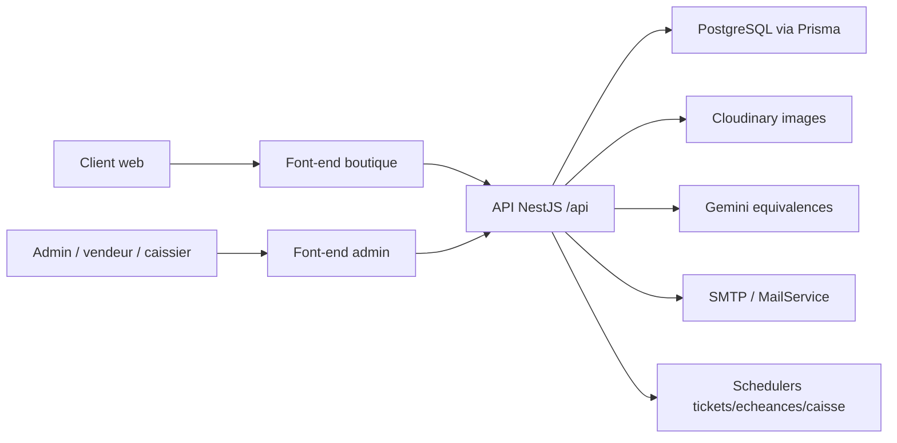
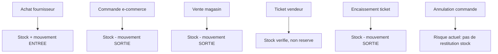

# Audit complet du projet NEWOTEG

Date de l'audit : 2026-06-01  
Racine analysee : `D:\Anime\NEWOTEG\Final-ecomerce-project`

## 1. Synthese executive

Le projet est une plateforme e-commerce et back-office pour NEWOTEG, composee de trois applications principales :

- `Back-end` : API NestJS 11, Prisma 7, PostgreSQL, JWT, Cloudinary, taches planifiees.
- `Font-end` : vitrine client React/Vite avec catalogue, panier, favoris, compte client et checkout.
- `Font-end-admin` : dashboard React/Vite/TypeScript pour gestion catalogue, ventes, achats, caisse, coffres, credits, roles, POS vendeur et file caissier.

Le projet couvre beaucoup plus qu'une simple boutique : il gere un vrai workflow operationnel magasin avec stock, achats, ventes, tickets vendeur-caissier, caisse journaliere, coffres virtuels, credits clients, notifications, echeances et import catalogue massif.

L'architecture globale est coherente et deja assez avancee. Les points forts majeurs sont :

- separation claire entre vitrine, admin et API ;
- modele Prisma riche, avec relations metier bien identifiees ;
- usage frequent de transactions Prisma pour les flux sensibles ;
- authentification separee client/admin ;
- roles admin operationnels (`SUPER_ADMIN`, `ADMIN`, `CAISSIER`, `VENDEUR`, `MANAGER`) ;
- import catalogue CSV/ZIP optimise par batch et upload Cloudinary ;
- caisse rendue partiellement immutable via annulation plutot que modification/suppression ;
- tests unitaires presents sur quelques domaines critiques.

Les risques principaux a traiter sont :

- annulation des commandes e-commerce sans restitution du stock ;
- endpoint frontend admin des valeurs d'attributs incompatible avec le backend ;
- stockage des tokens JWT dans `localStorage` ;
- seed du premier admin expose via endpoint public tant qu'aucun admin n'existe ;
- migrations lancees a plusieurs endroits au demarrage ;
- incoherences possibles entre caisse globale, caisse du jour et encaissements directs ;
- couverture de tests insuffisante sur les flux les plus risqués : commande, ticket, vente, credit, import.

## 2. Structure du depot

### Racine

Fichiers et dossiers importants :

- `Back-end/` : API NestJS.
- `Font-end/` : site e-commerce public.
- `Font-end-admin/NEWOTEG-ECOMMERCE-feature-new-dashboard/` : interface admin.
- `docs/` : documentation projet.
- `image-generator/` : scripts auxiliaires de generation/recherche d'images produits.
- `catalog/`, `unzipped_catalog/`, `import-test/`, `import-test.zip` : donnees ou artefacts d'import.
- `README.md`, `COMPTES_ET_LANCEMENT.md`, rapports de livraison et d'audit existants.

Le depot contient aussi des fichiers vides ou suspects a la racine (`git`, `main`) qui semblent etre des artefacts accidentels.

### Volumetrie observee

- Backend : environ 161 fichiers TypeScript dans `Back-end/src`.
- Front boutique : environ 77 fichiers JS/JSX/SCSS dans `Font-end/src`.
- Front admin : environ 46 fichiers TS/TSX/CSS dans `Font-end-admin/.../src`.
- Prisma : 20 entrees de migrations.
- Tests backend detectes : 6 fichiers `*.spec.ts` plus un test e2e.

## 3. Stack technique

### Backend

Technologies principales :

- NestJS 11.
- Prisma 7 avec adapter PostgreSQL `@prisma/adapter-pg`.
- PostgreSQL.
- JWT via `@nestjs/jwt` et `passport-jwt`.
- `class-validator` / `class-transformer`.
- `helmet`, `cookie-parser`, CORS configure.
- `@nestjs/schedule` pour les taches planifiees.
- Cloudinary pour les images.
- Nodemailer prevu pour l'email.
- Google Auth Library pour connexion Google client.
- Gemini via client maison pour suggestions d'equivalences.

Scripts importants :

- `npm run build` : genere Prisma puis build Nest.
- `npm run start:dev` : demarrage dev.
- `npm run start:migrate:prod` : migration puis lancement production.
- `npm run test`, `test:e2e`, `test:cov`.
- `npm run prisma:migrate:deploy`.

### Front boutique

Technologies :

- React 19.
- Vite 7.
- React Router 7.
- Axios.
- Sass.
- Lucide icons.
- Google OAuth.
- `react-helmet-async`.

Fonctions principales :

- accueil ;
- catalogue ;
- details produit ;
- panier ;
- checkout livraison/retrait ;
- compte client ;
- favoris ;
- pages about/contact/terms/privacy ;
- i18n FR/EN.

### Front admin

Technologies :

- React 19.
- Vite 6.
- TypeScript.
- Tailwind 4.
- Axios.
- Recharts.
- Motion.
- jsPDF/html2canvas pour generation de recus.
- Papaparse/JSZip pour traitement fichiers cote client.

Fonctions principales :

- dashboard ;
- analyses ;
- commandes ;
- produits/categories/attributs ;
- ventes/achats ;
- clients/credits ;
- fournisseurs ;
- mouvements stock ;
- caisse, caisse jour, coffres ;
- echeances ;
- roles/comptes/employes ;
- notifications ;
- POS vendeur, mes tickets, file caissier.

## 4. Modele de donnees

Le schema Prisma contient les grands domaines suivants.

### Catalogue

Modeles :

- `Categorie`
- `Produit`
- `Attribut`
- `ValeurAttribut`
- `SuggestionEquivalence`

Points notables :

- `Produit` possede prix detail, prix gros, promo, stock, seuil d'alerte, datasheet et trois images.
- Unicite produit : `[marque, nomProduit]`.
- Les attributs sont rattaches aux produits, pas aux categories.
- Les valeurs d'attribut sont cascade-delete avec leur attribut.

### Relations commerciales

Modeles :

- `Fournisseur`
- `Achat`
- `LigneAchat`
- `Client`
- `Commande`
- `LigneCommande`
- `Vente`
- `LigneVente`
- `Reglement`
- `Favori`

Points notables :

- Les commandes e-commerce et les ventes magasin sont separees.
- Les credits clients passent par `Vente.montantTotal`, `montantPaye`, `statutPaiement` et `Reglement`.
- Les commandes ont un `modeReception` : `LIVRAISON` ou `RETRAIT_MAGASIN`.

### Stock

Modele :

- `MouvementStock`

Les ventes, achats, commandes et ajustements creent ou devraient creer des mouvements de stock. C'est le journal de tracabilite attendu.

### Caisse et finance

Modeles :

- `Caisse`
- `CaisseJour`
- `Coffre`
- `Echeance`
- `AlerteEcheance`

Points notables :

- Les operations de caisse peuvent etre annulees sans suppression physique.
- Les transferts caisse/coffre utilisent un `transfertGroupId`.
- Une caisse du jour unique est creee par date.
- Les echeances gerent recurrence et alertes.

### Admin, roles et audit

Modeles :

- `AdminUser`
- `Role`
- `RoleHistory`
- `ActivityLog`
- `Notification`

Points notables :

- `AdminUser.role` est un enum fort.
- Le modele `Role` existe aussi, mais semble moins central que l'enum `AdminRole`.
- L'activite admin et l'historique des roles sont traces.

## 5. Architecture backend

### Initialisation

`src/main.ts` :

- lance `npx prisma migrate deploy` au bootstrap ;
- cree l'application Nest ;
- active Helmet avec CSP desactivee ;
- active `cookieParser` ;
- active `ValidationPipe` global avec `transform` et `whitelist` ;
- active un filtre global d'exceptions ;
- active un intercepteur global d'audit ;
- sert `/uploads` ;
- configure CORS pour localhost et domaines NEWOTEG ;
- applique le prefixe global `/api`.

Risque : les migrations sont lancees dans `main.ts`, dans le script `start:migrate:prod` et dans le `Dockerfile` via `npx prisma migrate deploy`. Cette redondance peut rallonger les demarrages, masquer des erreurs et rendre le comportement de production moins previsible.

### Modules

`AppModule` importe les modules metier :

- categorie, produit, attribut, valeur-attribut ;
- fournisseur, client, achat, ligne-achat ;
- vente, ligne-vente, tickets ;
- mouvement stock ;
- caisse, caisse jour, coffre, echeance, reglement ;
- role, auth client, auth admin ;
- commande, notification, recherche, favori, database, newsletter, cloudinary ;
- equivalence IA.

La modularisation est bonne et suit les domaines metier.

### Persistance

`DatabaseService` herite de `PrismaClient` et configure un `Pool` PostgreSQL via `PrismaPg`.

Points positifs :

- centralisation de la connexion ;
- logs Prisma limites a warn/error ;
- fermeture du pool au destroy.

Points a surveiller :

- pas de configuration explicite du pool depuis l'environnement ;
- pas de healthcheck DB visible ;
- pas de politique transactionnelle uniforme pour tous les flux.

## 6. API et routes principales

Toutes les routes backend sont prefixees par `/api`.

### Routes publiques principales

- `GET /api/produits`
- `GET /api/produits/:id`
- `GET /api/produits/metadata`
- `GET /api/produits/flash`
- `GET /api/produits/populaires`
- `GET /api/categories`
- `GET /api/categories/:id`
- `POST /api/auth/signup`
- `POST /api/auth/login`
- `POST /api/auth/google`
- `POST /api/auth/forgot-password`
- `POST /api/auth/reset-password`
- `POST /api/commandes`
- `POST /api/commandes/checkout`
- `POST /api/newsletter`
- `POST /api/equivalence/suggest`

### Routes client protegees

- `GET /api/auth/me`
- `GET /api/commandes/my-orders`
- `PATCH /api/commandes/:id/cancel`
- `PATCH /api/commandes/:id/reception`
- `GET/POST/DELETE /api/favoris`

### Routes admin protegees

- CRUD produits, categories, attributs, valeurs d'attributs.
- Gestion achats, ventes, fournisseurs, clients.
- Mouvements stock.
- Caisse et coffres.
- Caisse du jour.
- Reglements credits.
- Tickets POS.
- Commandes.
- Notifications.
- Admin-auth, comptes, roles.
- Recherche.
- Statistiques d'equivalences.

## 7. Flux metier importants

### Flux catalogue

Les produits peuvent etre crees/modifies/supprimes depuis l'admin. Les images passent par Cloudinary si configure. Les imports CSV/ZIP permettent :

- detection de plusieurs noms de colonnes ;
- creation automatique des categories ;
- upload d'images en parallele ;
- creation en masse ;
- mise a jour des produits existants ;
- sauvegarde partielle des doublons dans `PendingImport`.

Le service d'import est puissant mais complexe. Il merite des tests dedies, notamment sur les cas :

- colonnes dupliquees ;
- images absentes ;
- produits avec marque vide ;
- fichiers volumineux ;
- dates promo invalides ;
- conflits sur unicite.

### Flux commande e-commerce

Creation :

- verification produit/stock ;
- creation commande et lignes ;
- decrement du stock ;
- creation d'un mouvement `SORTIE`.

Annulation :

- change le statut en `ANNULEE`.
- ne restitue pas le stock.
- ne cree pas de mouvement inverse.

Constat critique : une commande annulee apres creation garde le stock decremente. Cela peut provoquer des ruptures artificielles et fausser l'inventaire.

### Flux vente magasin classique

Creation de vente :

- verification du stock ;
- creation vente et lignes ;
- decrement stock ;
- creation mouvements stock ;
- creation entree de caisse.

Point a surveiller : le service cree directement une entree de caisse globale, alors que le workflow ticket/caissier utilise plutot `CaisseJour`. Les deux modeles coexistent, mais leur usage doit etre strictement clarifie.

### Flux POS vendeur -> caissier

Creation ticket :

- vendeur cree un ticket avec lignes ;
- stock verifie mais non decremente ;
- ticket expire apres 15 minutes ;
- notification creee.

Encaissement :

- verifie statut et expiration ;
- exige client pour vente a credit ;
- cree la vente ;
- decremente stock ;
- cree mouvements stock ;
- cree reglement si acompte credit ;
- cree operation de caisse du jour seulement pour l'argent recu ;
- marque ticket `ENCAISSE`.

Ce flux est solide dans l'intention et mieux encapsule que la vente classique.

Risque concurrence : deux tickets peuvent verifier le meme stock avant encaissement. Le stock est reverifie a la creation du ticket mais pas verrouille/reserve. Lors de l'encaissement, le code decremente sans re-verification explicite dans la transaction. Il faut proteger le stock au moment de l'encaissement.

### Flux credits clients

Les ventes a credit sont suivies par :

- `Vente.statutPaiement` ;
- `Vente.montantPaye` ;
- `Reglement` ;
- operations de caisse liees au reglement.

Le recalcul de la vente apres reglement/annulation est un bon choix.

### Flux caisse et coffre

La caisse globale calcule le solde a partir des operations non annulees. Les coffres utilisent le meme modele `Caisse` avec `coffreId`.

La caisse du jour :

- est creee automatiquement par date ;
- centralise les encaissements caissier ;
- peut etre fermee ;
- transfere son solde vers la caisse globale via une operation recap.

Point important : la timezone est codee en `Africa/Douala`, alors que le contexte utilisateur actuel est `Africa/Lagos`. Les deux sont UTC+1 la plupart du temps, mais il vaut mieux externaliser la timezone magasin.

## 8. Front boutique

### Routage

Routes principales :

- `/`
- `/catalogue`
- `/product/:id`
- `/checkout`
- `/about`
- `/contact`
- `/terms`
- `/privacy`
- `/login`
- `/signup`
- `/profile`
- `/favourites`

### Etat cote client

Contextes :

- `AuthContext`
- `CartContext`
- `FavoritesContext`
- `I18nContext`

Stockage local :

- token client dans `localStorage` ;
- utilisateur dans `localStorage` ;
- panier dans `localStorage` ;
- favoris locaux ;
- langue.

Le choix est simple et fonctionnel, mais le token en `localStorage` augmente l'impact d'une faille XSS.

### API

`VITE_API_URL` est utilise avec fallback `http://localhost:3000/api`.

Le mapping produit centralise les URLs images et les champs issus du backend. C'est un bon point pour absorber les differences de format.

## 9. Front admin

### Routage et permissions

L'admin utilise :

- `AdminProtectedRoute` pour proteger l'espace admin ;
- `RoleProtectedRoute` pour limiter des pages selon le role.

Exemples :

- analyses : `SUPER_ADMIN`, `ADMIN` ;
- credits : `SUPER_ADMIN`, `ADMIN`, `CAISSIER` ;
- caisse : `SUPER_ADMIN`, `ADMIN` ;
- caisse jour : `SUPER_ADMIN`, `ADMIN`, `CAISSIER` ;
- comptes/roles/employes : `SUPER_ADMIN` ;
- POS : `SUPER_ADMIN`, `ADMIN`, `VENDEUR` ;
- file caissier : `SUPER_ADMIN`, `ADMIN`, `CAISSIER`.

Important : les protections front ameliorent l'UX, mais la vraie autorisation doit rester backend. Globalement, les guards backend existent sur les routes sensibles.

### API admin

`src/services/api.ts` centralise les appels Axios et injecte le bearer token.

Constat important :

- backend : `@Controller('valeurs-attribut')`
- frontend admin : appels vers `/valeur-attributs`

Cette difference casse probablement l'ecran de gestion des valeurs d'attributs.

### Gestion session admin

Le token admin est stocke dans `localStorage` sous `newoteg_admin_token`.

En cas de 401 :

- suppression du token ;
- redirection vers `/login?expired=1`.

C'est fonctionnel, mais a durcir avec cookies `httpOnly` ou au minimum une politique CSP plus stricte.

## 10. Securite

### Points positifs

- JWT client et JWT admin separes par strategie.
- Les tokens admin contiennent `type: 'admin'` et la strategie admin le verifie.
- Les comptes admin inactifs sont bloques.
- Les roles backend utilisent `RolesGuard`.
- `ValidationPipe` global avec whitelist.
- `helmet` active.
- CORS limite a une liste connue et variables d'environnement.
- Mots de passe hashes avec bcrypt.
- PIN hashes.
- Suppression/modification directe de caisse interdite.

### Risques et faiblesses

#### P1 - Tokens en localStorage

Les tokens client/admin sont persistés dans `localStorage`. En cas de XSS, ils sont lisibles et reutilisables.

Recommendation :

- migrer vers cookies `httpOnly`, `Secure`, `SameSite=Lax/Strict` ;
- ajouter refresh token court/long si necessaire ;
- renforcer CSP.

#### P1 - Endpoint seed admin public

`POST /api/admin-auth/seed` semble public. Le service refuse si un admin existe deja, mais lors d'un premier deploiement ou apres reset DB, c'est une surface sensible.

Recommendation :

- proteger par secret de bootstrap env ;
- desactiver en production ;
- remplacer par script CLI de provisioning.

#### P1 - CSP desactivee

Helmet est active, mais `contentSecurityPolicy: false`.

Recommendation :

- definir une CSP progressive compatible Cloudinary, Google OAuth et assets ;
- bloquer scripts inline si possible.

#### P2 - Rate limiting global peu cible

Le throttler global est a `100` par minute. Les routes login, PIN, forgot/reset password meritent des limites plus strictes.

Recommendation :

- limiter login/PIN par IP + identifiant ;
- ajouter lockout progressif ;
- tracer les echecs.

#### P2 - OTP reset password incomplet

Le forgot password genere un OTP, mais l'envoi email est TODO. En production, l'utilisateur recevra un message de succes sans email reel si le mail n'est pas implemente ailleurs.

Recommendation :

- brancher `MailService` ;
- tester reset complet ;
- ne pas logguer de code hors dev.

#### P2 - Secrets et configuration

`.env.example` est propre, mais il faut verifier les environnements deployes :

- `JWT_SECRET` fort ;
- `GOOGLE_CLIENT_ID` coherent entre front et back ;
- Cloudinary configure ;
- `FRONTEND_URLS` strict.

## 11. Qualite et maintenabilite

### Points positifs

- Modules backend bien separes.
- DTO nombreux.
- Transactions sur plusieurs flux critiques.
- Services metier relativement explicites.
- API admin centralisee cote front.
- Contextes React separes.
- Documentation existante abondante.

### Points a ameliorer

#### Typage

Beaucoup de `any` sont presents dans le backend et le front admin. Ce n'est pas bloquant, mais cela reduit la valeur de TypeScript sur les flux critiques.

Priorites :

- typer `req.user` ;
- typer les transactions Prisma ;
- typer les DTO front admin ;
- eviter `any` dans `services/api.ts`.

#### Encodage

Plusieurs fichiers affichent des caracteres mal encodes dans les commentaires/messages (`é`, `—`, etc.). Cela ne casse pas toujours l'execution, mais degrade l'UX et la maintenance.

Recommendation :

- normaliser les fichiers en UTF-8 ;
- corriger les messages utilisateur ;
- ajouter une verification d'encodage en CI si possible.

#### Duplication de logique

Les flux commande, vente et ticket reproduisent des operations similaires :

- verifier stock ;
- decremente stock ;
- creer mouvement ;
- creer caisse.

Recommendation :

- extraire progressivement des services de domaine : `StockService`, `CaisseLedgerService`, `OrderInventoryService`.

#### Cohesion caisse

La coexistence caisse globale / caisse du jour est utile, mais certains flux ecrivent directement en caisse globale et d'autres en caisse du jour.

Recommendation :

- formaliser une regle : tout encaissement comptoir passe par `CaisseJour`, puis cloture vers caisse globale ;
- garder la caisse globale pour historiques/clotures/transferts/coffres ;
- adapter `VenteService.create` si necessaire.

## 12. Tests

Tests detectes :

- `app.controller.spec.ts`
- `database.controller.spec.ts`
- `database.service.spec.ts`
- `caisse.service.spec.ts`
- `coffre.service.spec.ts`
- `echeance.service.spec.ts`
- `test/app.e2e-spec.ts`

Couverture actuelle : utile mais insuffisante au regard de la complexite metier.

Tests prioritaires a ajouter :

- commande creation + annulation + restitution stock ;
- ticket creation + expiration + encaissement ;
- concurrence stock sur ticket/vente/commande ;
- vente credit + reglement + annulation reglement ;
- caisse jour fermeture et transfert global ;
- endpoint valeurs d'attributs ;
- import ZIP avec images manquantes et doublons ;
- seed admin bloque en production.

## 13. Deployment et operations

### Backend Docker/Railway

Le Dockerfile :

- build en `node:20-alpine` ;
- installe via `npm ci` ;
- build Nest ;
- genere Prisma ;
- production avec `npm ci --omit=dev` ;
- lance `node scripts/ensure-schema.js && npx prisma migrate deploy && node dist/src/main`.

Risque :

- `ensure-schema.js` cree potentiellement des tables directement, puis migrations Prisma sont appliquees. Cela peut contourner la discipline normale des migrations.
- `main.ts` relance aussi `migrate deploy`.

Recommendation :

- choisir une seule strategie de migration ;
- eviter `ensure-schema` en production sauf contexte de recovery documente ;
- ajouter healthcheck `/health` avec DB ping ;
- journaliser version de build et migration.

### Fronts

Les deux fronts sont Vite, avec `vercel.json` present. Le front admin utilise par defaut `/api` pour beneficier d'un proxy/rewrite en production.

Points a verifier :

- rewrites Vercel vers backend ;
- variables `VITE_API_URL` par environnement ;
- domaines CORS alignes.

## 14. Constats prioritaires

### P1 - Stock non restaure lors de l'annulation commande

Impact : inventaire faux, ruptures artificielles, pertes de vente.

Observation :

- `CommandeService.create` decremente le stock et cree un mouvement.
- `CommandeService.cancel` met seulement le statut `ANNULEE`.

Correction recommandee :

- dans une transaction, annuler uniquement les commandes annulables ;
- incrementer le stock de chaque ligne ;
- creer un `MouvementStock` de type `RETOUR` ou `AJUSTEMENT` ;
- rendre l'operation idempotente.

### P1 - Endpoint valeurs d'attributs incoherent

Impact : ecran admin des valeurs d'attributs probablement non fonctionnel.

Observation :

- backend : `valeurs-attribut`
- frontend : `valeur-attributs`

Correction recommandee :

- aligner le front sur `/valeurs-attribut` ou ajouter un alias backend.

### P1 - Seed admin public

Impact : risque de prise de controle sur base vierge.

Correction recommandee :

- supprimer l'endpoint public en production ;
- utiliser un script CLI ou secret `BOOTSTRAP_ADMIN_SECRET`.

### P1 - Tokens en localStorage

Impact : compromission session en cas de XSS.

Correction recommandee :

- cookies `httpOnly` pour auth ;
- CSP stricte ;
- durees de vie token plus courtes selon role.

### P2 - Risque de survente sur tickets

Impact : deux tickets peuvent consommer le meme stock si encaissements concurrents.

Correction recommandee :

- reverifier stock dans la transaction d'encaissement ;
- utiliser update conditionnel (`quantiteStock >= quantite`) ou verrou transactionnel adapte ;
- gerer erreur de stock devenu insuffisant.

### P2 - Migrations redondantes

Impact : demarrage lent, erreurs masquees, comportement prod confus.

Correction recommandee :

- retirer `migrate deploy` de `main.ts` ;
- garder migration dans pipeline/deploiement ;
- clarifier `ensure-schema.js`.

### P2 - Caisse globale vs caisse jour

Impact : reporting financier potentiellement incoherent si certains encaissements contournent la caisse du jour.

Correction recommandee :

- definir une regle unique d'ecriture ;
- auditer `VenteService`, `TicketVenteService`, `ReglementService`, `CommandeService.processPickup`.

### P2 - Reset password sans email finalise

Impact : fonctionnalite incomplete en production.

Correction recommandee :

- brancher SMTP ;
- ajouter test e2e forgot/reset.

### P3 - Encodage degrade

Impact : messages mal affiches, maintenance penible.

Correction recommandee :

- conversion UTF-8 propre des fichiers affectes.

### P3 - Artefacts de depot

Impact : bruit et confusion.

Elements :

- fichiers vides `git`, `main` ;
- donnees import volumineuses dans le depot ;
- `build_error.txt` conserve dans le front admin.

Correction recommandee :

- nettoyer ou documenter ;
- deplacer gros artefacts hors git si non necessaires.

## 15. Recommandations de roadmap

### Phase 1 - Corrections bloquantes

1. Corriger la restitution de stock lors de l'annulation commande.
2. Aligner `/valeurs-attribut`.
3. Durcir ou retirer `/admin-auth/seed`.
4. Ajouter verification stock transactionnelle a l'encaissement ticket.
5. Corriger les routes front manquantes visibles : le footer pointe vers `/shipping`, et le login pointe vers `/forgot-password`, mais ces routes ne sont pas definies dans `App.jsx`.

### Phase 2 - Securite

1. Migrer auth vers cookies `httpOnly`.
2. Ajouter CSP.
3. Ajouter throttling dedie login/PIN/reset.
4. Finaliser email reset password.
5. Externaliser la timezone magasin.

### Phase 3 - Fiabilite metier

1. Unifier les services stock/caisse.
2. Ajouter tests sur commandes, tickets, credits, caisse.
3. Ajouter healthcheck backend.
4. Clarifier migrations et deploiement.
5. Ajouter logs metier structures.

### Phase 4 - Maintenabilite

1. Reduire les `any`.
2. Corriger l'encodage.
3. Nettoyer artefacts racine.
4. Documenter les flux metier avec diagrammes.
5. Ajouter CI : lint, test, build backend, build front boutique, build front admin.

## 16. Diagramme logique simplifie

## 17. Diagramme des flux stock

## 18. Verifications executees

Commandes lancees pendant l'audit :

- `npm.cmd test -- --runInBand` dans `Back-end`
- `npm.cmd run build` dans `Font-end`
- `npm.cmd run lint` dans `Font-end-admin/NEWOTEG-ECOMMERCE-feature-new-dashboard`

Resultats :

- Backend : OK. Les 6 suites Jest passent, 20 tests passes.
- Front boutique : KO. Le build Vite echoue avec l'erreur Rollup/Vite : `The "fileName" or "name" properties of emitted chunks and assets must be strings that are neither absolute nor relative paths`, avec `D:/Anime/NEWOTEG/Final-ecomerce-project/Font-end/index.html`.
- Front admin : KO. Le typecheck `tsc --noEmit` echoue notamment sur `src/components/ui/Button.tsx` et ses usages dans `Employes.tsx`, `ConfirmDialog.tsx`, `FileCaissier.tsx`, `MesTickets.tsx`. Les erreurs indiquent que `children`, `disabled`, `className` ou `key` ne sont pas acceptes par certains types de props.

Interpretation :

- Le backend est testable dans l'etat actuel.
- La boutique ne produit pas de build de production valide dans l'environnement teste.
- L'admin a des erreurs TypeScript qui bloquent la commande de lint/typecheck.

Priorite ajoutee :

- P1/P2 : restaurer une CI minimale avec `backend test`, `front build`, `admin typecheck`.
- P2 : corriger le build Vite boutique.
- P2 : corriger les types du composant `Button` et des composants de tickets/admin.

## 19. Conclusion

Le projet est fonctionnellement ambitieux et dispose d'une base solide : backend modulaire, modele Prisma complet, interfaces separees, roles admin, caisse, credits, tickets et import catalogue. Il est deja proche d'un systeme de gestion boutique + e-commerce.

La priorite n'est pas de tout refondre, mais de securiser les flux critiques :

- stock ;
- caisse ;
- authentification ;
- commandes ;
- tickets ;
- migrations/deploiement.

Une fois ces points corriges et couverts par des tests, le projet sera beaucoup plus fiable pour une exploitation reelle.
